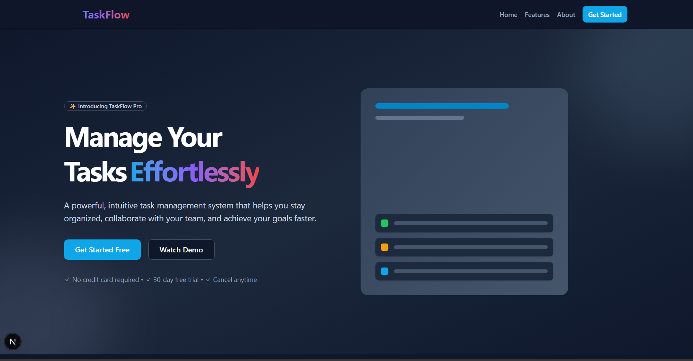
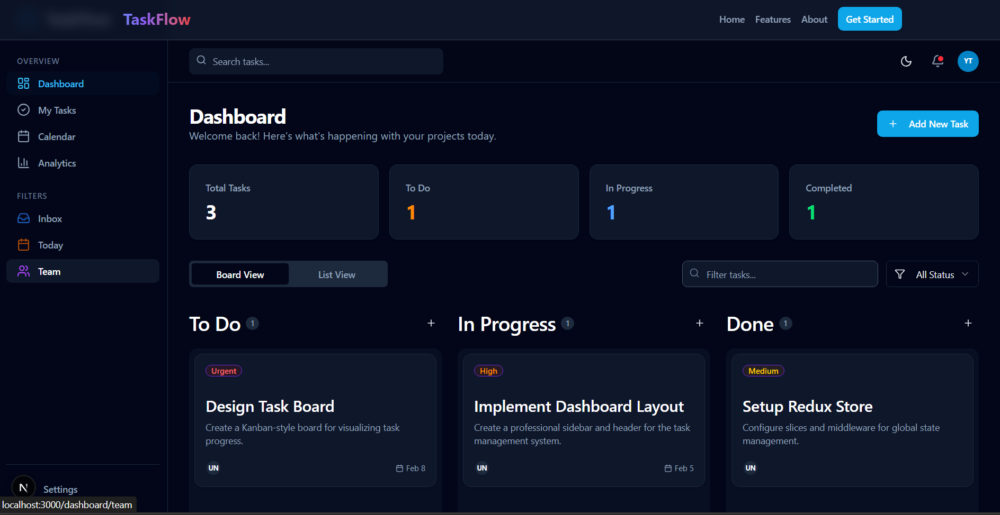
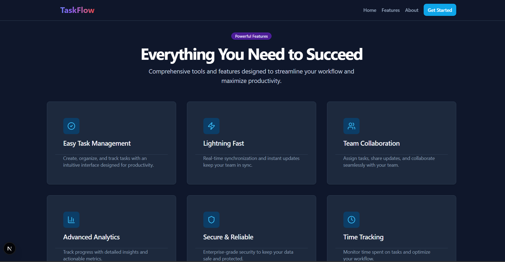
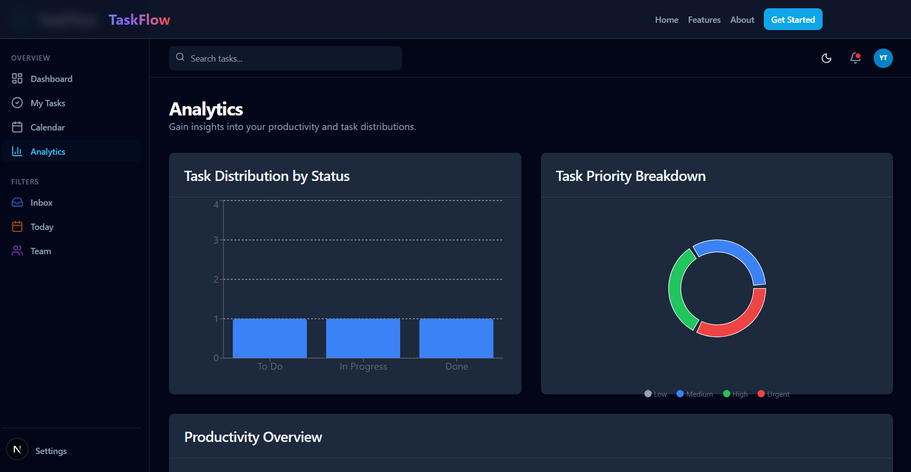
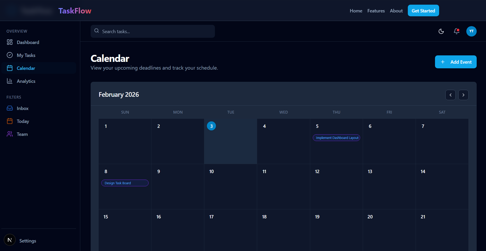
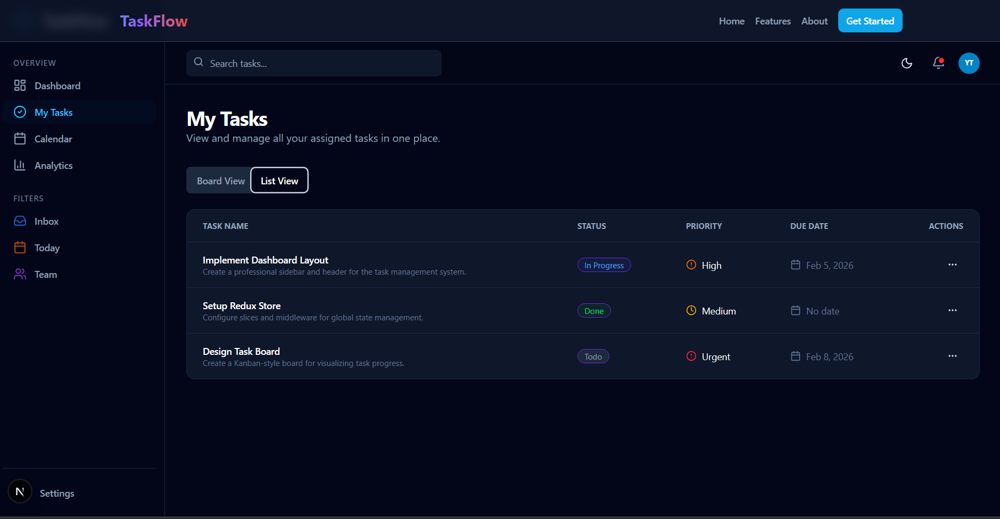
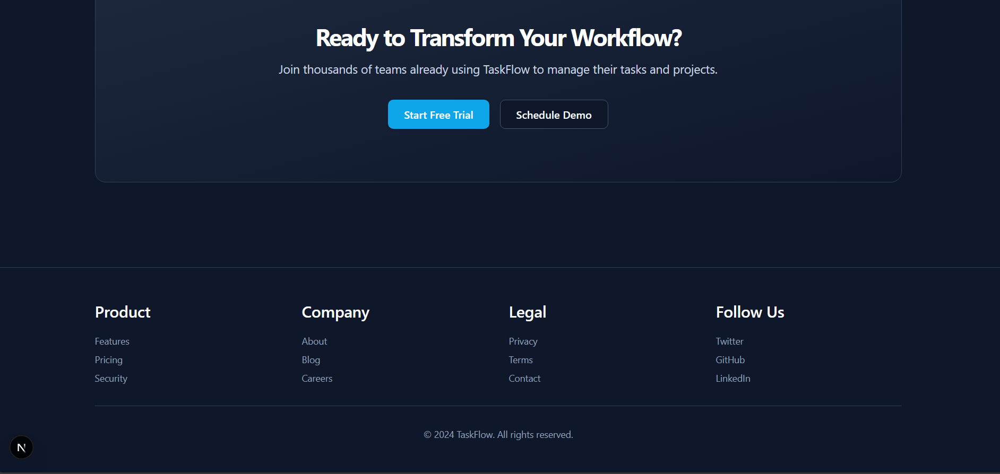

<div align="center">
  
  <h1>🚀 TaskFlow</h1>
  <p><b>A professional, simple task-management-system frontend only.</b></p>

  <p>
    
    
    
    
  </p>
</div>

---

## ✨ Overview

> ⚠️ **This project is still in development phase.** New features and improvements are being added regularly.

TaskFlow is a high-performance, responsive task management dashboard prototype. It's built to demonstrate a premium user experience with **Dark Mode**, **Real-time Filters**, and **Persisted State**.

> [!NOTE]
> This is a **Frontend-Only** project. All data is managed via Redux and persists in your browser's LocalStorage.

## 🖼️ Screenshots

<div align="center">
  <h3>Homepage</h3>
  

  <br />

  <h3>Main Dashboard</h3>
  

  <br />

  <h3>Features</h3>
  

  <br />

  <h3>Analytics & Charts</h3>
  

  <br />

  <h3>Interactive Calendar</h3>
  

  <br />

  <h3>Tasks View</h3>
  

  <br />

  <h3>Footer</h3>
  
</div>

---

## 🛠️ Tech Stack

- **Framework**: [Next.js 15](https://nextjs.org/) (App Router)
- **State Management**: [Redux Toolkit](https://redux-toolkit.js.org/)
- **Styling**: [Tailwind CSS 4.0](https://tailwindcss.com/)
- **UI Components**: [Radix UI](https://www.radix-ui.com/)
- **Icons**: [Lucide React](https://lucide.dev/)
- **Charts**: [Recharts](https://recharts.org/)
- **Persistence**: LocalStorage with Redux Hydration

---

## 🚀 Key Features

- **📊 Advanced Analytics**: Visualize task distribution by status and priority using interactive charts.
- **📅 Visual Calendar**: Manage deadlines effortlessly with a monthly calendar view.
- **🌓 Dark / Light Mode**: Seamless theme switching with system preference detection.
- **🔍 Smart Filtering**: Instantly search and filter tasks by status.
- **📱 Fully Responsive**: Optimized for every device, from mobile to ultra-wide monitors.
- **💾 Local Persistence**: Your tasks stay saved even after a page refresh.

---

## 🏗️ Getting Started

1. **Clone the repository**:
   ```bash
   git clone https://github.com/yogeshthapa-7/task-management-system.git
   ```

2. **Install dependencies**:
   ```bash
   npm install
   ```

3. **Run the development server**:
   ```bash
   npm run dev
   ```

4. **Build for production**:
   ```bash
   npm run build
   ```

---

<div align="center">
  <p>Built with ❤️ by <a href="https://github.com/yogeshthapa-7">Yogesh Thapa</a></p>
</div>
